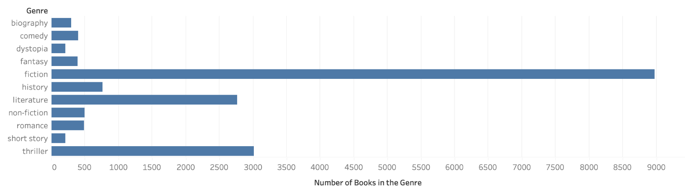
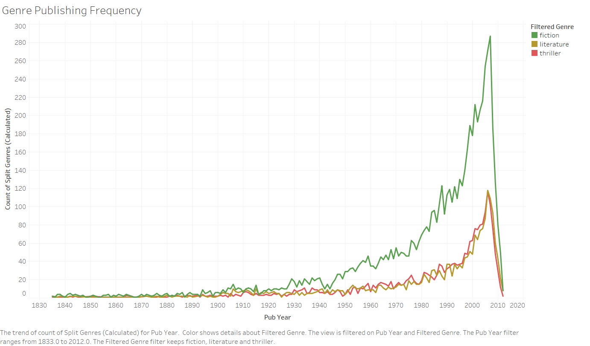
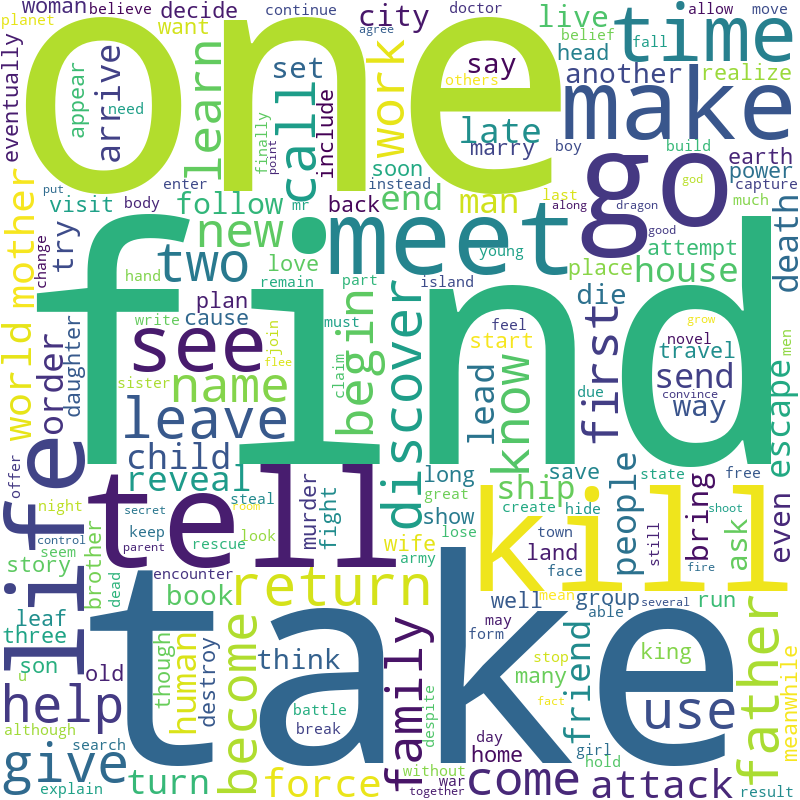
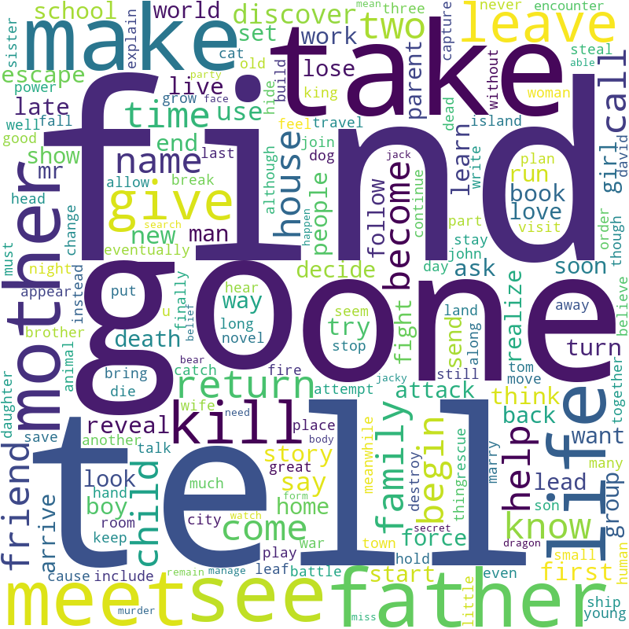
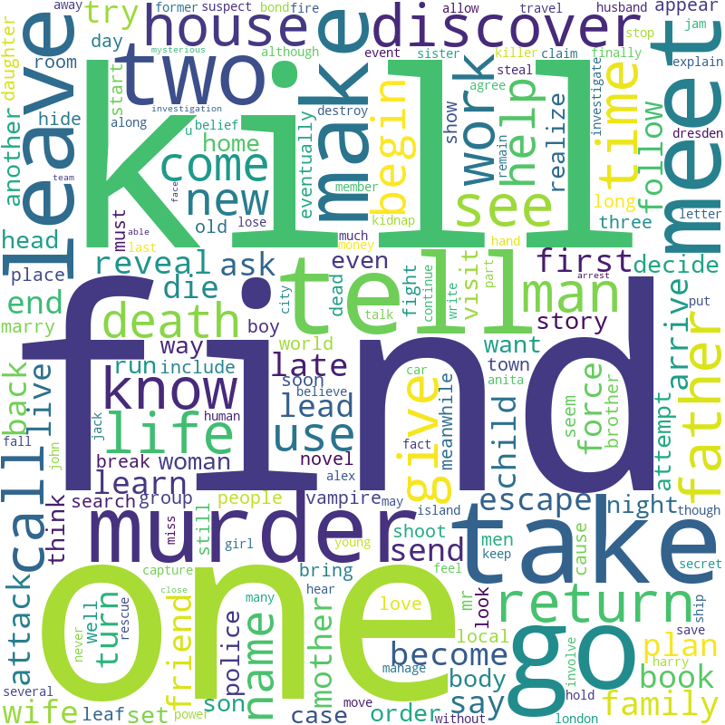
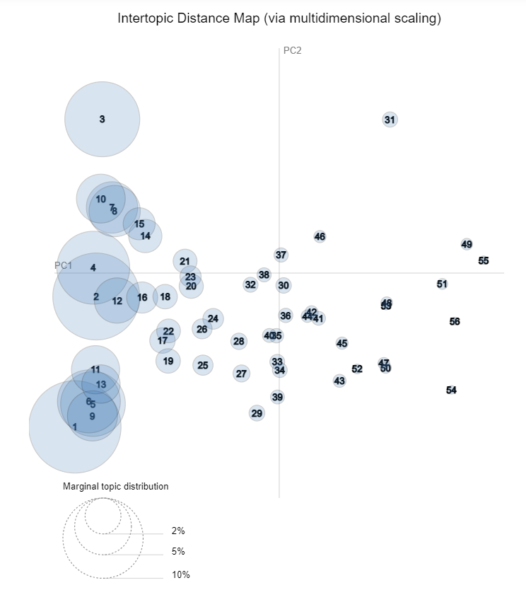
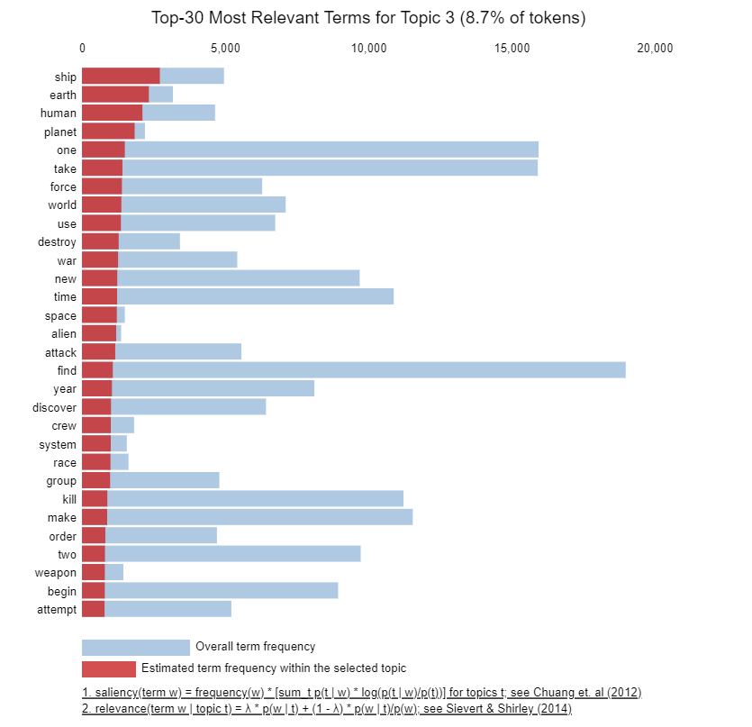

# CS 7641 Group 44 

## Introduction and Background
The goal of the project is to develop a system that recommends books tailored to an individual's preferences. With a vast array of books available, choosing one can be challenging. This system aims to simplify the process by using a dataset from Wikipedia that includes information on 16,559 books, such as titles, authors, genres, and summaries. The current literature includes work related to predicting genre of fiction through short Goodreads descriptions (Sobkowicz, Kozlowski & Buczkowski 2017) or from texts of fanfictions (Rahul, Ayush, Agarwal & Vijay 2021) and predicting the likability of books using the book cover images (Maharjan, Montes-y-Gomez, Gonzales & Solorio 2018). By focusing on personal preferences and a wide range of genres, the project addresses the shortcomings of current recommendation systems, which tend to overlook the specific interests of readers and favor popular titles over personalized selections. The intention is to enhance the book-finding experience, making it more enjoyable and efficient for users seeking books that match their tastes. 

 

Dataset Link: [CMU Book Summary Dataset](https://www.kaggle.com/datasets/ymaricar/cmu-book-summary-dataset)

## Problem statement

Our project aims to develop a natural language system to classify book genres from text summaries and further build a recommendation engine to suggest books based on summaries. 

## Method
Before applying any machine learning algorithms, data preprocessing was necessary, particularly for the genre and summary columns of our dataset. The genre information was formatted in a dictionary structure with multiple genres listed for each book. Within the dictionary structure, the keys were the genre ID from the database that the genre information was sourced from. The values were the genres themselves. For each data point, we first extracted the genres and transformed them into a single string, with commas separating each of the multiple genres. We then found that there were 227 unique genres in our dataset, but many of them were very specific with only 1 or 2 books belonging to each of those granular genres. Thus, we decided to manually consolidate the 227 unique genres into 11 broader genres: biography, comedy, dystopia, fantasy, fiction, history, literature, non-fiction, romance, short story, and thriller. After this pre-processing step, we found that each book was associated with 1 to 5 genres. Even with the number of genres we found that the 11 classes were very imbalanced, as presented in Figure 1 of the Results and Discussion section. We are fine-tuning our model to predict the smaller classes more accurately currently. For now, we will present our results only for the prediction of the 3 largest classes: fiction, literature, and thriller.  

 

For the summary text, we began by applying some natural language processing. With the help of the NLTK package, we tokenized the summary text, lemmatized the resulting tokens, and filtered for stopwords included in the NLTK stopwords dictionary. We have used the output to create TF-IDF (Term Frequency-Inverse Document Frequency) vectors. We also tried an alternate vectorizer in a GloVe (Global Vectors for Word Representation) model to create word embeddings. To implement this, we used the pre-trained "glove-wiki-gigaword-50" which was trained on 2 billion Tweets, 27 billion tokens, and 1.2 million vocabularies available on Hugging Face. Currently, we are in the process of learning about BERT (Bidirectional Encoder Representations from Transformers), another method of creating vector representations of text data.  

 

Using the vectorized book summary, we can finally train classification models to predict genre. The fact that our data contains more than 2 classes and the fact that each book can have more than 1 genre makes our problem more complex compared to a standard binary classification problem. We take a one vs. all approach for each of the classes. The 2 classifier models that yielded the best results for us are the logistic regression and random forest models. We will present the performance of each combination of the 2 vectorizers and 2 classifiers. In the next section we will present 12 F1 scores in total – for each vectorizer and classifier combination and for each of the 3 classes.

## Results and Discussion 

### Class-wise F1 score

**Fiction**

|        | Logistic Regression | Random Forest |
| :------: | :-------------------: | :-------------: |
| GloVe  | 86.16               | 87.86         |
| TF-IDF | 87.43               | 88.38         |

**Literature**

|        | Logistic Regression | Random Forest |
| :------: | :-------------------: | :-------------: |
| GloVe  | 47.99               | 56.68         |
| TF-IDF | 43.19               | 29.52         |

**Thriller**

|        | Logistic Regression | Random Forest |
| :------: | :-------------------: | :-------------: |
| GloVe  | 55.98               | 61.42         |
| TF-IDF | 59.21               | 60.54         |

**Average across classes**

|        | Logistic Regression | Random Forest |
| :------: | :-------------------: | :-------------: |
| GloVe  | 63.38               |  68.65        |
| TF-IDF | 59.48               | 63.27         |

Our models perform decently well to predict book genres from their summaries. GloVe embeddings combined with Random Forest classifier yielded the best overall performance. However, further fine-tuning and experimentation with other techniques could potentially improve the classification accuracy, especially for the less dominant genres such as literature and thriller. 

Exploring alternative word embedding techniques (e.g., Word2Vec, FastText) or classifiers (e.g., Support Vector Machines, Gradient Boosting) could provide insights into which combinations work best for our specific task. Additionally, neural network-based architectures, such as recurrent neural networks (RNNs) or transformers, could be explored for their potential to capture sequential information in book summaries and improve classification accuracy. 

 
## Visualizations

_Figure 1: Genre frequency_

The graph shows the number of books in each genre. The graph shows that fiction has the greatest number of books. We can see that we have very imbalanced classes in our data. 

_Figure 2: Genre Publishing Frequency Over Time_

This time series graph displays the number of books published over time in the three most popular genres: “fiction”, “thriller”, and “literature”. 

_Figure 3: Word cloud of Fiction Genre_

This word cloud displays the most popular words in the summaries of all the books in the fiction genre. The three most common words are “find”, “kill”, and “take”. 

_Figure 4: Word cloud of Literature Genre_

The word cloud of the literature genre shows that words “find”, “go”, “one” and “tell” are the most repeated words among all the books in the genre. 

_Figure 5: Word cloud of Thriller Genre_

The word cloud of the thriller genre shows that words “find”, “kill”, and “one” are the most repeated words among all the books in the genre. From Figure 3, 4, and 5, we can see there are overlaps in the set of commonly occurring words. Words like “kill” and “make” occur frequently in 2 of the 3 classes. This pattern can make it difficult for an algorithm to discern between the 2 classes. 

## Topic-Based Recommendation/Unsupervised Learning 

After building our LDA model with 56 topics and coherence score of 0.446, we use the pyLDAvis package to visualize the topics.

The above figure displays the map between the 56 topics modelled by LDA. The sizes of the circles represent how common the topic is, and the proximity of circles represents how similar the topics are to each other. We can see that some topics, like Topic 3, are very distinct while other topics have many overlaps. Past the first 30 topics, the topic prevalence visually is quite small. We chose to the number of topics based on the coherence score, but perhaps it may be appropriate to include some limit based on topic prevalence if we were to repeat this analysis in the future. 

The above figures display the most relevant terms in 2 example topics: Topic 3 and Topic 8. The visualizations display the within topic term frequency compared to the overall frequency of the term in the corpus. Inherently, we do not have a label for each topic, but we can infer what each topic is about by looking at the relevant terms. For example, Topic 3 seems to be related to science fiction, space, and interstellar warfare. Topic 8 seems to be related to history, specifically World War II perhaps.  

 

This result is valuable because it allows us to interpret the topics that the LDA algorithm produced and think about why certain books may be assigned to the same topic. This allows us to recommend books to readers based on the topic that they enjoy. This is distinct from recommending books based on genre. For example, a reader may enjoy a historic fiction novel based on WWII as well as a nonfiction book that is informative about WWII. The genre of those two books may be different, but the LDA approach could identify the two books as having the same topic. Unlike our supervised learning models, LDA allows us to use an unsupervised approach to group books independent of genre or any other characteristic. Compared to other possible recommendation algorithms, the application of LDA for recommendation has advantages over collaborative filtering approaches in that LDA only uses summary information which makes it viable for brand new books and does not require any user rating data.   

 
 

Although some like Topic 3 and Topic 8 were very distinct, some topics were not very informative and filled with overly common words and/or names of characters. If we were to repeat the LDA analysis again in the future, processing out certain proper nouns may help make each topic more distinct and informative. We can make exceptions for historical figures since unlike the names of fictional characters, the names of historical figures may be helpful in identifying the topic of a book. We can also introduce limits on terms based on document frequency in addition to the stopword removal to further cut down the number of non-unique terms.  

## Contribution Table 

|               Task               |       Contributor        |
| :------------------------------: | :----------------------: |
|              Report              |           All            |
|          Data Cleaning           |          Andrew          |
| Summary Text Data Pre-Processing |          Andrew          |
|    Exploratory Data Analysis     |           Urvi           |
|       Implementing models        |       Urvi, Aditya       |
|           Gantt Chart            |         Sanjana          |
|        Contribution Table        |     Dhruval, Sanjana     |
|          Visualizations          | Andrew, Sanjana, Dhruval |
|   Quantitative Scoring Metric    |          Aditya          |
| LDA Design and Visualization     |       Sanjana, Urvi      |
|      LDA Feature Reduction       |         Andrew           |
| LDA Implementation and Evaluation|         Andrew           |
| GloVe, TF-IDF, LDA comparison    |           All            |
|    Video Creation & Recording    |         Sanjana          |
|          Final Report            |           All            |

## Gantt chart

<object data="assets/ML_GanttChart_final.pdf" width="1000" height="500" type='application/pdf'>Gantt chart</object>
